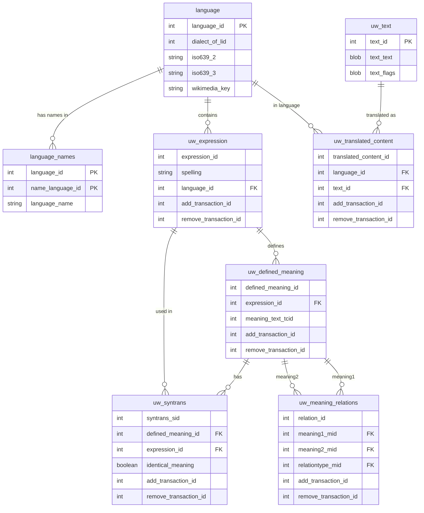

# OmegaWiki Data Processing Tools

OmegaWiki was a collaborative multilingual dictionary project (now discontinued).

This project provides tools for processing and querying OmegaWiki database dumps.

## Requirements

- Python 3 (no additional libraries required)
- SQLite 3

## Tools

- `sql2tsv.py`: Extracts data from SQL dump to TSV format
- `dump2sqlite.py`: Creates a SQL from SQL dump to import the data into SQLite
- `omegawiki.py`: Extracts multilingual word lists from the database

## Directory Structure

- `db/`: Contains database processing scripts and data files
- `examples/`: Contains example language extraction scripts
- `etc/`: Experimental files and resources

## Database Schema

Below is an Entity-Relationship diagram of the main tables in the OmegaWiki database:



## Processing the Database

In `db/` directory:

1. Place the OmegaWiki dump file `omegawiki-lexical-20230530.sql.gz` retrieved from:  
   https://huggingface.co/datasets/n7shi/OmegaWiki
2. Extract the `.gz` file using `gunzip`
3. Run `make` to create `omegawiki.db`

To clean up generated files:

```bash
make clean
```

## Extracting Language Data

Example usage for extracting multilingual word lists:

```bash
cd examples
make
```

This will create:

- `Latin.tsv`: Latin words with Italian, Spanish, French, English, and Japanese translations
- `Ido.tsv`: Ido words with Esperanto, Latin, French, English, and Japanese translations

Note: Ido is a constructed language based on Esperanto.

Custom language extraction can be done using:

```bash
python omegawiki.py db/omegawiki.db [source-lang] [target-lang1] [target-lang2] ...
```
